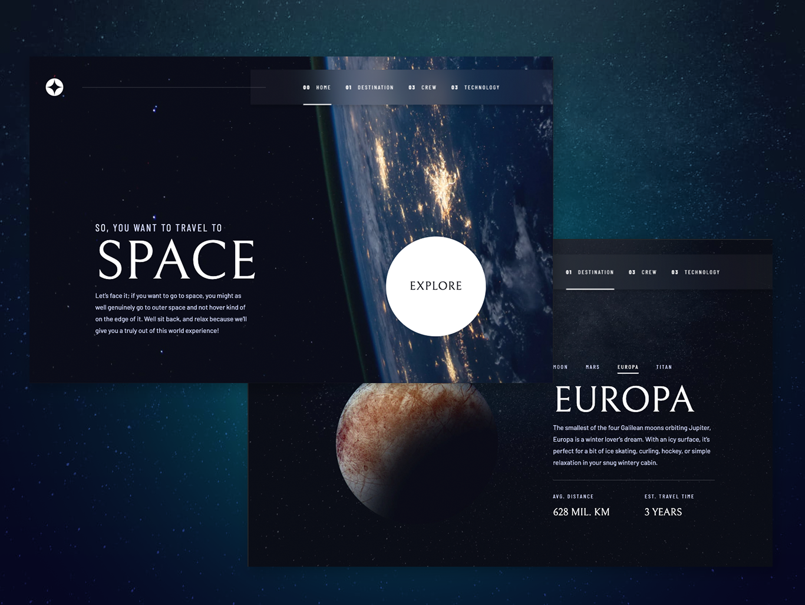
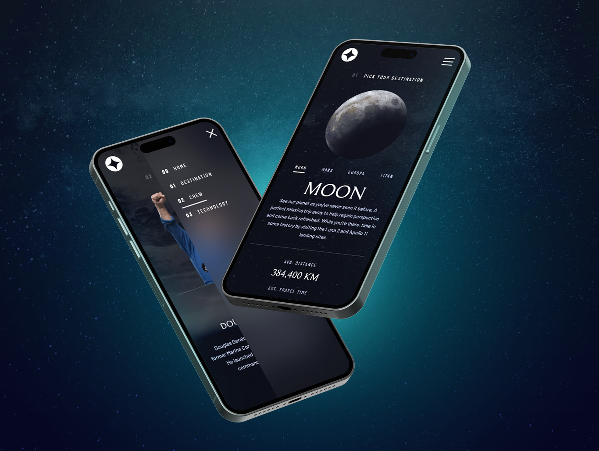

# Frontend Mentor - Space tourism website solution

This is a solution to the [Space tourism website challenge on Frontend Mentor](https://www.frontendmentor.io/challenges/space-tourism-multipage-website-gRWj1URZ3). Frontend Mentor challenges help you improve your coding skills by building realistic projects.

## Table of contents

- [Overview](#overview)
  - [The challenge](#the-challenge)
  - [Screenshot](#screenshot)
  - [Links](#links)
- [My process](#my-process)
  - [Built with](#built-with)
  - [What I learned](#what-i-learned)
  - [Useful resources](#useful-resources)
- [Author](#author)

## Overview

### The challenge

Users should be able to:

- View the optimal layout for each of the website's pages depending on their device's screen size
- See hover states for all interactive elements on the page
- View each page and be able to toggle between the tabs to see new information

### Screenshot





### Links

- Solution URL: [Github Repository](https://github.com/lorenacrincon/space-tourism-website)
- Live Site URL: [Click Here!](https://space-tourism-website-lilac-pi.vercel.app/)

## My process

### Built with

- Semantic HTML5 markup
- CSS custom properties
- Flexbox
- CSS Grid
- Mobile-first workflow
- [React](https://reactjs.org/) - JS library
- [Next.js](https://vitejs.dev/)
- [TailwindCss](https://tailwindcss.com/) - For styles
- [Framer Motion](https://www.framer.com/motion/) - For animations

### What I learned

This challenge helped me put into practice a new tool for me, which is Frameet Motion. It also helped me reinforce practices in grid layout.

```jsx
<div className="md:order-last lg:basis-1/2 lg:absolute lg:right-10 lg:bottom-0  2xl:pe-40 3xl:pe-80">
  <motion.picture
    key={value}
    initial={{ opacity: 0 }}
    animate={{ opacity: 1 }}
    exit={{ opacity: 0 }}
    transition={{ duration: 1 }}
  >
    <source srcet={images.webp} type="image/webp" />
    
  </motion.picture>
</div>
```

### Useful resources

- [Framer Motion](https://www.framer.com/motion/) - I really liked this library and will use it going forward.

## Author

- GitHub Profile - [Lorena Rincón](https://github.com/lorenacrincon)
- Frontend Mentor - [@lorenacrincon](https://www.frontendmentor.io/profile/lorenacrincon)
- Linkedin Profile - [Lorena Rincón](https://www.linkedin.com/in/lore-rincon)
